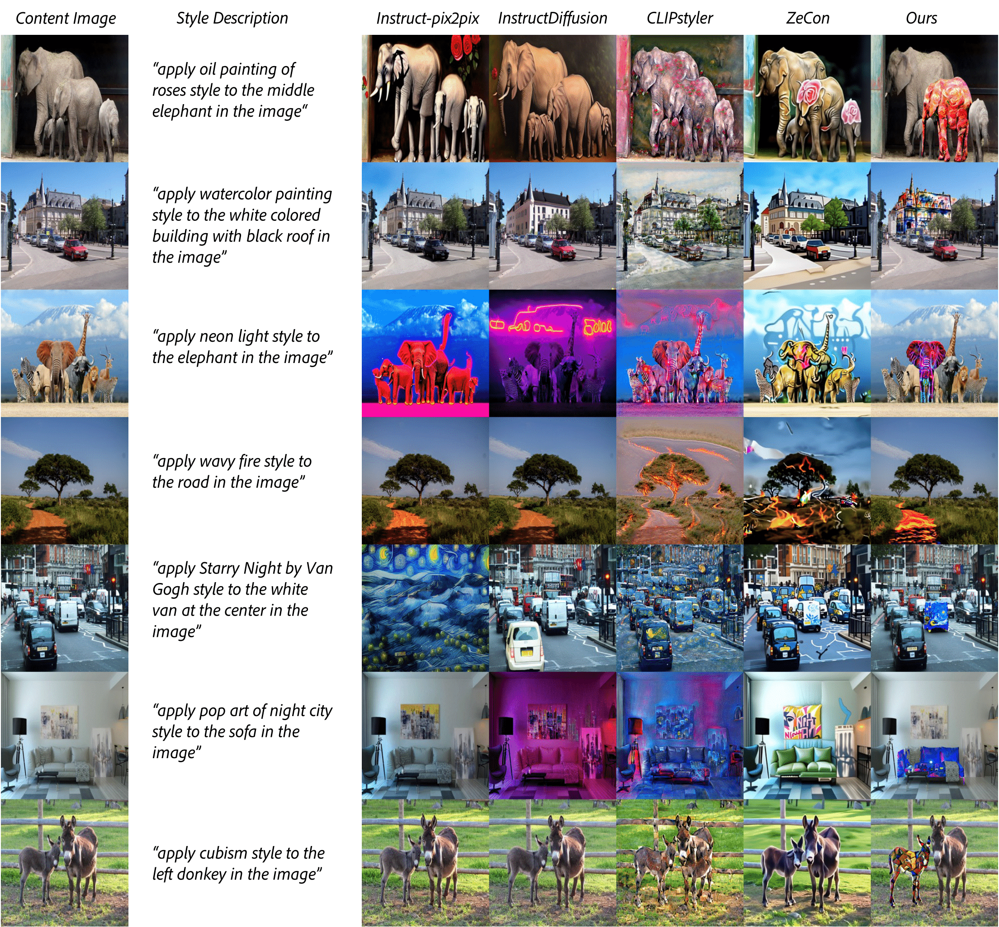

# LEAST: "Local" text-conditioned image style transfer

*Accepted to AI for Content Creation (AI4CC) Workshop at CVPR 2024*

*Silky Singh, Surgan Jandial, Simra Shahid, Abhinav Java.*  
Media and Data Science Research (MDSR), Adobe

Project Page: [arXiv]()

## Installation

## Acknowledgments

This repository is heavily based on [CLIPstyler](https://github.com/cyclomon/CLIPstyler), [LLaVA](https://github.com/haotian-liu/LLaVA) and [Segment Anything](https://github.com/facebookresearch/segment-anything). We thank all the respective authors for open-sourcing their amazing work!

## Citation

If you find our work useful, please consider citing:

